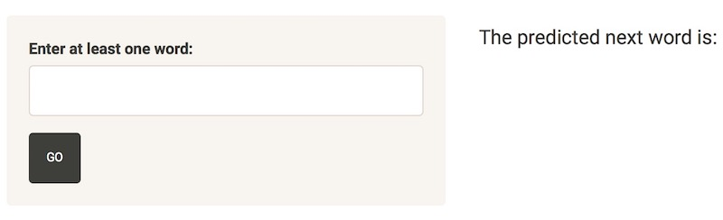
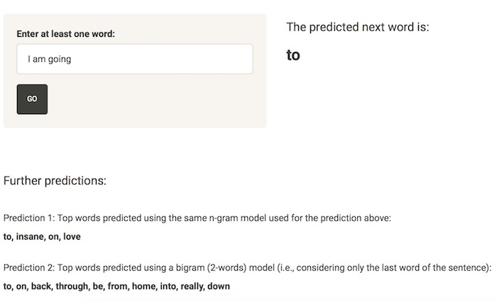

## Next Word Prediction App - Introduction

What is it purpose? How does the underlying algorithm work?

The purpose of this app is to predict the next word of a series of words.

Depending on the number of words given as input, n-gram models will predict the next word: if the input is one word, the app will use a bigram (2-words) model; if the input is two words, the app will use a trigram (3-words) model; if the input is three words, the app will use a quadrigram (4-words) model.

For example, with three words as input, the app will try to predict the next word with a quadrigram model. If this model is not able to return a prediction, the next word guess will be made using a trigram model; if the prediction is still not achieved, the app will use a bigram model (in which the next word is predicted based on only the last word in the input sentence). If a bigram model cannot predict the next word, the word 'the' will be returned as prediction.

These N-gram models were built using text data from news, twitter and blogs provided by SwiftKey. 

## Next Word Prediction App - Introduction

How to use this app?

Enter at least one word and press the 'Go' button. After the first button press, the next word will be automatically predicted without pressing the 'Go' button again.

## Next Word Prediction App - a glimpse

A screenshot of an example prediction:

## Next Word Prediction App - conclusions

- The app can be found [here](https://elisab.shinyapps.io/myCapstoneApp/)

- The code can be found [here](https://github.com/elibattistoni/DataScienceCapstone)

